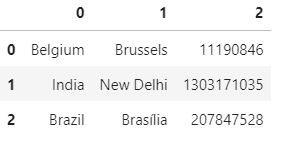

# Pandas

## 통계분석과 빅데이터 분석의 차이

통계분석은 데이터를 분석할 때 모수(전체수)가 있는데 그것을 알고 싶기 때문에 모수를 추론하기 위해서 샘플링을 하게 된다. 샘플을 갖고서 모수를 추정하는 것이 전통적인 통계분석의 기법. 1000명 대상의 샘플링을 통해 5000여명의 생각을 알고 싶은 것이기에 샘플의 의미 파악이 중요하다.

빅데이터 분석은 이와 조금 다르다. 이미 모수(전체수)를 갖고 있다는 점이다. 빅데이터 분석은 기존 모수 안에 숨겨진 패턴, 보이지 않았던 패턴과 규칙을 찾는 것이 관건이 된다는 것. 이미 모수를 갖고 있기 때문에 샘플링이 의미가 없고 데이터 안에서 분석을 하면 되는 것이 기존 통계분석과는 다르다. 그러다보니 기존 데이터를 어떻게 나눌까, 분류를 할까. 데이터 간의 거리 계산 등에 중점을 두게 된다.


### 잔차(Residual) 과 손실(Loss or Cost)

- 잔차(residual) :  관측값과 회귀직선의 예측값과의 차이
- 손실(loss or cost) : 실제 값과 예측 값의 차이를 제곱하여 평균을 낸 값


## Pandas

Pandas는 다음과 같은 특징을 같습니다.
- NumPy를 내부적으로 활용함(NumPy의 특징을 그대로 가짐)
- 데이터분석에 특화된 데이터 구조 제공
- 다양한 데이터 분석 함수 제공
- 데이터베이스에 쉽게 연결 가능

파이썬에서 pandas를 사용할 때는 일반적으로 다음과 같이 pd형태로 임포트해서 사용합니다.

```python
import pandas as pd
```


### Series

- 1차원 데이터 구조
- 일반적으로 s 또는 sr로 이름 붙임

```python
s = pd.Series([3, -5, 7, 4]) # 인덱스 없이 생성
s
```

```
0    3
1   -5
2    7
3    4
dtype: int64
```

위와 같이 결과를 보면 딕셔너리의 key값이 인덱스(index)로, value값이 값으로 들어간 것을 알 수있다.
결국 시리즈는 딕셔너리 구조와 비슷하다고 생각할 수 있다.

인덱스를 특별히 지정해주지 않으면 NumPy 다차원배열처럼 0부터 인덱스가 시작된다.

NumPy 다차원 배열과 다르게 Pandas Series는 인덱스를 지정해 줄 수 있으며 숫자가 아닌 문자열도 인덱스가 될 수 있다.

```python
s = pd.Series([3, -5, 7, 4], index=['a', 'b', 'c', 'd'])
s
```

```
a    3
b   -5
c    7
d    4
dtype: int64
```

`type()`을 통해 데이터타입이 Series인 걸 확인할 수 있다.

```python
type(s)
```

```
pandas.core.series.Series
```

Series는 요소는 index명 또는 index의 순서를 통해 인덱싱할 수 있습니다.

```python
# index명으로 조회
s['a']
```

```
3
```

```python
# index순서로 조회
s[0]
```

```
3
```

#### 파이썬 딕셔너리와 Pandas Series의 공통점, 차이점

Index와 value를 가진다는 점에서 key와 value를 가지는 파이썬 딕셔너리와 유사하다 볼 수 있습니다.

그렇기에 파이썬 딕셔너리를 통해 Series를 생성할 수 있습니다.

```python
# pop_dict는 파이썬 딕셔너리
pop_dict = {'Germany': 81.3, 
            'Belgium': 11.3, 
            'France': 64.3, 
            'United Kingdom': 64.9, 
            'Netherlands': 16.9}

# pop_dict로 Series 생성
population = pd.Series(pop_dict)
population
```

```
Germany           81.3
Belgium           11.3
France            64.3
United Kingdom    64.9
Netherlands       16.9
dtype: float64
```

딕셔너리와 Series의 차이점은, 딕셔너리의 Key는 순서가 없고 pandas Series의 index는 순서가 있다는 점입니다.
그렇기에 Series는 index의 순서를 통해서도 value 조회가 가능합니다.

```python
# KeyError 발생(2라는 Key 값은 없음)
pop_dict[2]
```

```
---------------------------------------------------------------------------
KeyError                                  Traceback (most recent call last)
<ipython-input-17-acf7040711f3> in <module>
      1 # KeyError 발생(2라는 Key 값은 없음)
----> 2 pop_dict[2]

KeyError: 2
```

```python
population[2]
```

```
64.3
```

### DataFrame
- 2차원 데이터 구조
- 일반적으로 df로 이름 붙임
- 엑셀 스프레드시트, 데이터베이스등과 동일한 2차원 구조
- 가장 많이 활용하게될 구조
- Series가 합쳐진 형태

중첩된 리스트나 딕셔너리를 통해 DataFrame을 생성할 수 있습니다.

```
# 중첩된 리스트를 통한 데이터 생성
# 각 행을 리스트로 만들어야 함
data = [['Belgium', 'Brussels', 11190846],
        ['India', 'New Delhi', 1303171035],
        ['Brazil', 'Brasília', 207847528]]

df = pd.DataFrame(data)

df
```



columns 파라메터를 통해 칼럼명 역시 정해줄 수 있습니다.

```python
# 중첩된 리스트를 통한 데이터 생성
# 각 행을 리스트로 만들어야 함
data = [['Belgium', 'Brussels', 11190846],
        ['India', 'New Delhi', 1303171035],
        ['Brazil', 'Brasília', 207847528]]

df = pd.DataFrame(data, columns=['Country', 'Capital', 'Population'])

df
```


`type()`을 통해 데이터타입이 DataFrame인 걸 확인할 수 있습니다.

```python
type(df)
```

```
pandas.core.frame.DataFrame
```

데이터프레임 각 열의 데이터타입은 Series라는걸 알 수 있습니다.

```python
type(df['Country'])
```

```
pandas.core.series.Series
```

#### 속성

아래와 같은 속성을 가집니다.

- index
- columns
- dtypes
- values

```python
df.index
```

```
RangeIndex(start=0, stop=3, step=1)
```


```python
df.columns
```

```
Index(['Country', 'Capital', 'Population'], dtype='object')
```
