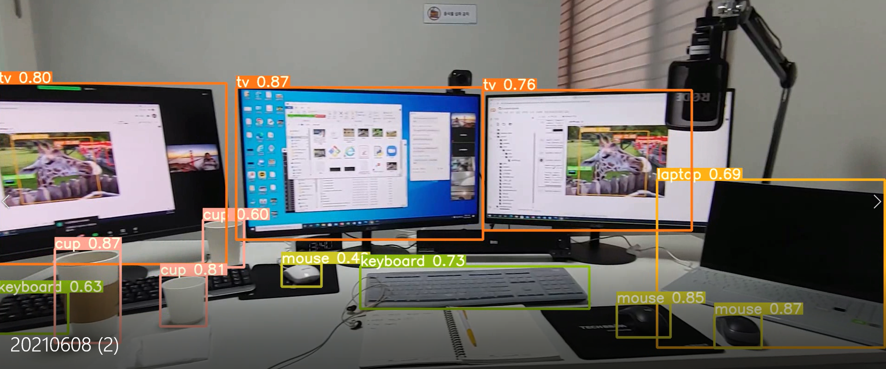

##  git github 사용사례

- 3_yolov5.ipynb로 실습

  https://colab.research.google.com/github/ultralytics/yolov5/blob/master/tutorial.ipynb#scrollTo=wbvMlHd_QwMG

- 아래 코드를 실행하여 yolov5와 sample_data를 불러온다

```python
!git clone https://github.com/ultralytics/yolov5  # clone repo
!pip install -qr yolov5/requirements.txt  # install dependencies (ignore errors)
%cd yolov5
```

- 이후 아래 구글 드라이브 폴더 아이콘을 클릭한다.

  

- 클릭 후 colab에 다음과 같은 코드가 생긴다


- 이 코드를 누르면 authorization code를 입력하라고 나온다.

- 링크를 클릭하면 구글 계정으로 로그인 한 후 허용 버튼을 누르면 코드가 생성된다. 생성된 코드를 입력한다.

  

- 다음과 같이 나온다.

  

- `!pwd`현재 위치를 확인하면`/content/yolov5` 라고 나타날 것이다.

- 다음 코드를 입력하여 이미지를 보여주고 이미지를 다운할 수 있도록 설정한다.

  ```
  import torch
  from IPython.display import Image, clear_output  # to display images
  from utils.google_utils import gdrive_download  # to download models/datasets
  ```

- 분석할 이미지`elephant2.png`를 업로드한다.

  

- 이후 `detect.py`를 활용하여 `elephant2.png`이미지를 인식하고 분석한다.

  - (`detect.py` runs YOLOv5 inference on a variety of sources, downloading models automatically from the [latest YOLOv5 release](https://github.com/ultralytics/yolov5/releases), and saving results to `runs/detect`.)

  ```
  !python detect.py --source ../elephant2.png
  ```

  ```
  Namespace(agnostic_nms=False, augment=False, classes=None, conf_thres=0.25, device='', exist_ok=False, half=False, hide_conf=False, hide_labels=False, img_size=640, iou_thres=0.45, line_thickness=3, max_det=1000, name='exp', nosave=False, project='runs/detect', save_conf=False, save_crop=False, save_txt=False, source='../elephant2.png', update=False, view_img=False, weights='yolov5s.pt')
  YOLOv5 🚀 v5.0-150-gabb2a96 torch 1.8.1+cu101 CUDA:0 (Tesla K80, 11441.1875MB)
  
  Downloading https://github.com/ultralytics/yolov5/releases/download/v5.0/yolov5s.pt to yolov5s.pt...
  100% 14.1M/14.1M [00:00<00:00, 55.8MB/s]
  
  Fusing layers... 
  Model Summary: 224 layers, 7266973 parameters, 0 gradients
  image 1/1 /content/yolov5/../elephant2.png: 384x640 2 elephants, Done. (0.069s)
  Results saved to runs/detect/exp
  Done. (0.206s)
  ```

- 결과는 `runs/detect/exp`에서 확인한다. 

- 코끼리라는 태그와 확률이 나타난다.

  

- 이번엔 `2021068.mp4`동영상으로 테스트를 해본다.

  ```
  !python detect.py --source ../20210608.mp4
  ```

  ```
  Namespace(agnostic_nms=False, augment=False, classes=None, conf_thres=0.25, device='', exist_ok=False, half=False, hide_conf=False, hide_labels=False, img_size=640, iou_thres=0.45, line_thickness=3, max_det=1000, name='exp', nosave=False, project='runs/detect', save_conf=False, save_crop=False, save_txt=False, source='../20210608.mp4', update=False, view_img=False, weights='yolov5s.pt')
  YOLOv5 🚀 v5.0-150-gabb2a96 torch 1.8.1+cu101 CUDA:0 (Tesla K80, 11441.1875MB)
  
  Fusing layers... 
  Model Summary: 224 layers, 7266973 parameters, 0 gradients
  video 1/1 (1/222) /content/yolov5/../20210608.mp4: 384x640 3 tvs, 1 laptop, 3 mouses, 2 keyboards, Done. (0.029s)
  ...(생략)
  video 1/1 (222/222) /content/yolov5/../20210608.mp4: 384x640 1 bottle, 4 cups, 3 tvs, 2 mouses, 2 keyboards, Done. (0.028s)
  Results saved to runs/detect/exp2
  ```

- 결과는 `runs/detect/exp2`에서 확인할 수 있다.  파일을 클릭하면 다른이름으로 저장하고 저장 후 파일을 확인한다.

  

