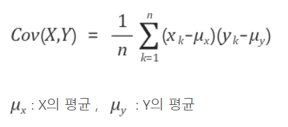
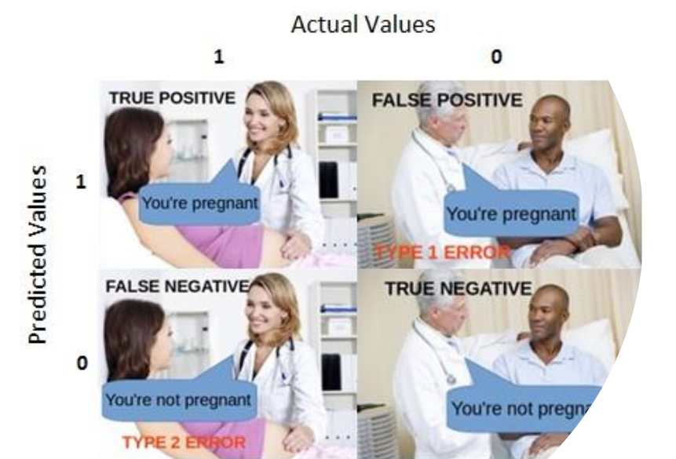
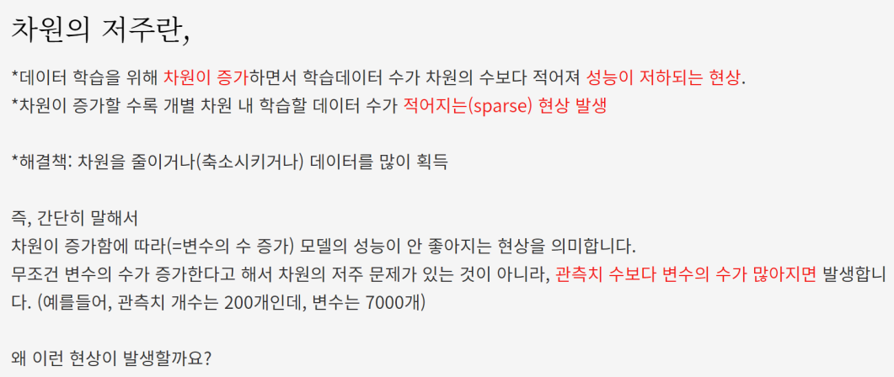
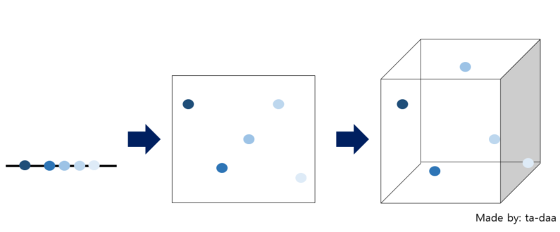
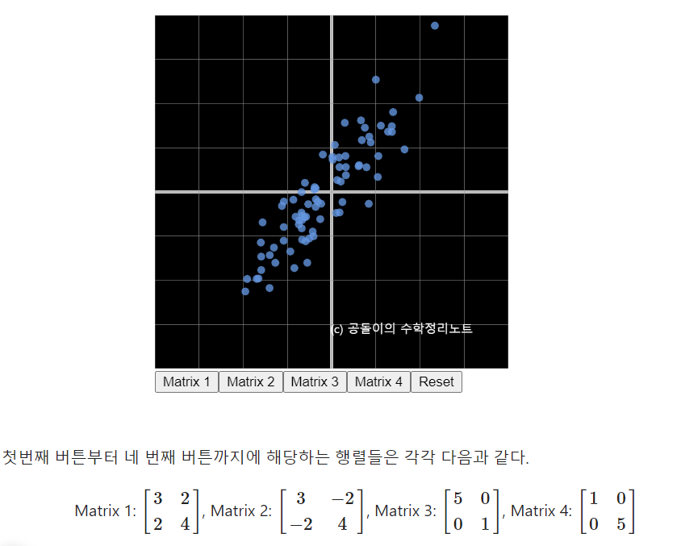
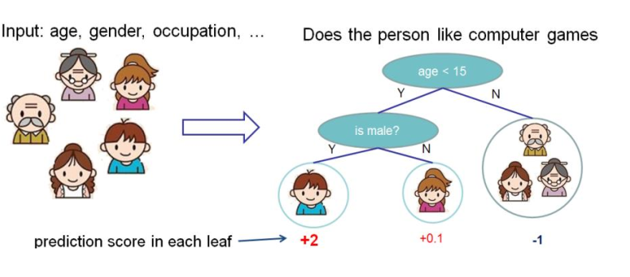
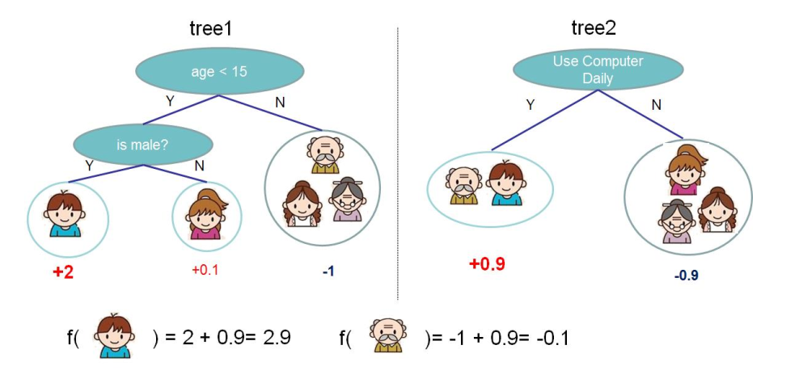
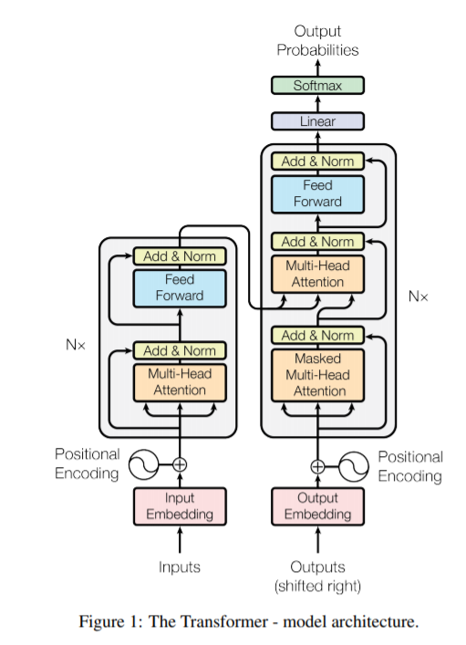
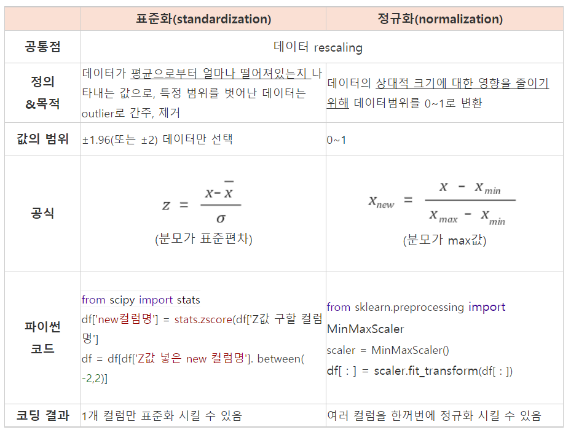

# 210609~210610 내용 정리

## 평균, 분산, 공분산

### 평균 (mean)

평균값, 다 더해서 그 개수로 나눠줌.


### 편차 (deviation)

: **평균값으로부터의 차이.**

: 그러나 합계가 0임. --> 평균값을 기준으로 차이를 계산했기 때문(단, 편차의 평균은 0)

: 고로 합계를 이용하여 흩어진 정도를 파악할 수 없음.


### 분산 (variance)

: 흩어진 정도를 파악하고자하니 편차는 합계가 0이라 이용할 수 없음..

: 대신 **편차에서 부호를 없애고 사용하기 위해 제곱을 하고 다시 평균**을 냄.


### 표준편차 (standard deviation)

: 분산(variance)는 단위도 함께 제곱되면서 그 의미가 애매해지는데 이를 위해 **분산(variance)의 제곱근**인 표준편차를 사용함.


### 공분산 (covariance)

: 위에서 봤던 분산과 표준편차들은 하나의 변수를 위한 값이었음.

: 공분산은 **서로 다른 두 변수 사이의 관계를 보기 위함**. 

: 두 변수가 서로 다른 단위를 사용하더라도 신경쓰지않고 구하면 됨. --> 애초에 서로 다른 데이터 간 관계를 표현하는 지표를 사용했기 때문.

: **공분산의 절대값 크기는 아무런 의미가 없음!!!!**



- **Cov(X, Y) > 0** : 양의 관계에 있다고 표현. --> 어느 하나가 증가하면 다른 하나도 증가함

- **Cov(X, Y) < 0** : 음의 관계에 있다고 표현. --> 어느 하나가 증가하면 다른 하나는 감소함

- **Cov(X, Y) = 0** : 선형관계 없음

Reference :

https://hyeonnii.tistory.com/292


------


## 분류모델

### Confusion matrix

- True Positive(TP) : 실제 True인 정답을 True라고 예측 (정답)

- False Positive(FP) : 실제 False인 정답을 True라고 예측 (오답)

- False Negative(FN) : 실제 True인 정답을 False라고 예측 (오답)

- True Negative(TN) : 실제 False인 정답을 False라고 예측 (정답)

  


### Accuracy(정확도)

정확도란 전체 중에서 정답을 맞춘 비율


### Precision(정밀도)


정밀도란 모델이 True라고 분류한 것 중에서 실제 True인 것의 비율이다.


### Recall(재현율)


재현율이란 실제 True인 것 중에서 모델이 True라고 예측한 것의 비율이다.  sensitivity 또는 hit rate라고도 불리고 1에 가까울 수록 좋다. 재현율은 단점은 정밀도와 비슷하다.

 

Reference :

- https://rk1993.tistory.com/entry/%EB%AA%A8%EB%8D%B8-%EC%84%B1%EB%8A%A5-%ED%8F%89%EA%B0%80-%EC%A7%80%ED%91%9C-%ED%9A%8C%EA%B7%80-%EB%AA%A8%EB%8D%B8-%EB%B6%84%EB%A5%98-%EB%AA%A8%EB%8D%B8?category=880112


------


## PCA

### PCA를 왜 쓸까? 

PCA를 사용하면 다중공선성 문제, 차원의 저주 문제를 해결할 수 있고, 차원을 축소해주기때문에 사람이 쉽게 관찰하고 이해할 수 있는 2차원으로 데이터들을 보여줄 수 있기 때문에 사용한다.


### PCA는 어떤 알고리즘인가?

PCA는 차원축소 알고리즘으로 생각하기보다는 기존 변수를 조합해 새로운 변수를 만드는 변수 추출(Feature Extraction)기법

 이때, 변수 선택(Feature Selection) 기법과 용어가 헷갈릴 수 있는데

1. 변수 선택(Feature Selection) : 있는 변수 중 결과값을 잘 표현할 수 있는 변수를 (있는 변수들 중에서) 단순히 고르는것

2. 변수 추출(Feature Extraction) : 변수들을 조합해 새로운 변수를 만들어 결과값을 잘 표현하는 방법

좀 더 스마트하게 PCA 알고리즘을 설명해보면, 기존의 변수들을 선형 결합(linear combination)하여 새로운 변수를 만들어 내는 기법

Reference :

https://youtu.be/g-Hb26agBFg


### 차원의 저주 문제와 다중공선성 문제를 어떻게 해결?

#### 1) 차원의 저주





차원은 커졌지만 데이터의 양이 부족하다면, 차원의 일부 공간에 제한되서 혹은 공간별로 소수의 데이터만을 설명하기 때문에 학습된 것만 잘 맞추는 과적합(Overfitting) 문제가 발생할 수 있다.

따라서, PCA 알고리즘으로 차원을 줄여주게 된다면 데이터가 적은 차원에서 밀도있게 표현되기 때문에 차원의 저주 문제를 해결할 수 있다.

**고차원 → 저차원 으로 줄이게 된다면 계산량이 줄어드는 효과도 기대할 수 있음**


#### 2) 다중공선성(multicollinearity) 문제

다중공선성 문제는 변수들간의 상관관계가 높을때 문제가 발생한다.

유식하게 표현해보자면 독립변수들 간의 강한 상관관계가 나타날때 다중공선성 문제가 발생한다.

다중공선성이 왜 문제냐?

회귀분석의 가정(전제 조건)인 변수들간의 상관관계가 높으면 안된다는 가정을 위배함

상관계수가 높다면 X1, X2라는 변수가 있을때 오롯이 X1이 Y값에 어느정도 영향을 미쳤는지

X2값은 얼마나 영향을 미쳤는지 알 수 없다. 따라서 X1, X2에 붙게되는 계수(=회귀계수)를 신뢰할 수 없게된다.

따라서, PCA 알고리즘은 주성분 PC1과 PC2를 찾는 과정에서 두 변수가 직교해야하기때문에

두 변수 사이의 상관관계가 0으로 나타나 다중공선성 문제를 해결할 수 있게된다


Reference :

https://specialscene.tistory.com/11


- **PCA가 말하는 것 : **

  **데이터들을 정사영 시켜 차원을 낮춘다면,
  어떤 벡터에 데이터들을 정사영 시켜야 원래의 데이터 구조를 제일 잘 유지할 수 있을까?**


### 공분산 행렬(convariance matrix)




Matrix 1의 1행 1열의 원소는 1번 feature의 variance를 나타낸다. 즉, x축 방향으로 얼마만큼 퍼지게 할 것인가를 말해준다.

1행 2열의 원소와 2행 1열의 원소는 각각 x, y축으로 함께 얼마만큼 퍼지게 할 것인가를 말해준다. (기울기)

2행 2열의 원소는 y축 방향으로 얼마만큼 퍼지게 할 것인가를 말해준다.

Reference : 

https://angeloyeo.github.io/2019/07/27/PCA.html


### 선형 변환(Linear Transformations)

어떤 벡터 v에 행렬 A를 곱한 결과가 벡터 b라고 하면, 아래와 같이나타낼 수 있음.
$$
Av =b
$$
즉, 행렬 A를 이용해 벡터 v를 b로 변환한 것. 이런 과정을 선형 변환이라고 함. 혹은 벡터 v를 다른 벡터 b로 매핑(maps)했다고 함.
$$
A\qquad\quad v\qquad\qquad		b\\

\begin{pmatrix} 2 & 1 \\ 1.5 & 2 \end{pmatrix} \begin{matrix} 0.75 \\ 0.25 \end{matrix} = \begin{matrix} 1.75 \\ 1.625 \end{matrix}
$$


Reference : 

https://m.blog.naver.com/PostView.naver?isHttpsRedirect=true&blogId=angryking&logNo=221206754322


### 고유값(Eigenvalue), 고유벡터(Eigenvector)

임의의 nxn행렬 A에 대하여 0이 아닌 솔루션 벡터 x가 존재한다면 숫자 λ는 행렬 A의 고유값이라고 할수 있다.
$$
A\vec{x} = \lambda \vec{x}
$$


고유벡터는 행렬 A를 곱하더라도 방향이 변하지 않고 그 크기만 변한다.


[고유 벡터(eigenvector)의 의미](https://angeloyeo.github.io/2019/07/17/eigen_vector.html)를 잘 생각해보면, 고유 벡터는 그 행렬이 벡터에 작용하는 주축(principal axis)의 방향을 나타내므로 공분산 행렬의 고유 벡터는 데이터가 어떤 방향으로 분산되어 있는지를 나타내준다고 할 수 있다.


- 데이터를 고유벡터(eigenvector)에 정사영하면 분산이 최대가 되고, 그때 분산은 고유값(eigenvalue)이다.

  

Reference : 

https://m.blog.naver.com/PostView.naver?isHttpsRedirect=true&blogId=angryking&logNo=221206754322

https://www.youtube.com/watch?v=YEdscCNsinU&feature=youtu.be


------


## XGBoost: A Scalable Tree Boosting System  
- XG Boost와 엔트로피 관련 설명

  Reference : 

  https://brunch.co.kr/@hvnpoet/95






------


## Q&A


### 최근 AI 트렌드?

- GPT-3 : https://openai.com/blog/gpt-3-apps/

- attention in all you need 라는 논문 

  : https://arxiv.org/abs/1706.03762

  

- open ai : https://openai.com/blog/

- open ai 달리 : https://openai.com/blog/dall-e/


## 종속변수, 독립변수

예시 : credit_cards_datatset.csv


### 종속변수

default.payment.next.month

종속변수 = target variable


### 독립변수

default.payment.next.month 외 기타변수


## 머신러닝에서 일반적 Data Preparation 과정 정리

### 1. 데이터 준비 과정의 중요성

- 데이터 정리 : 데이터의 오류 또는 오류를 식별하고 수정
- 특징 선택 : 작업과 가장 관련된 입력 변수 식별
- 데이터 변환 : 변수의 척도 또는 분포 파악
- 특징 엔지니어링 : 사용 가능한 데이터에서 새로운 변수 도출
- 차원 감소 : 데이터의 간결한 예측 생성


### 2. 결측치의 처리방법

누락된 값을 데이터로 채우는 것을 데이터 대치라고 하며 데이터 대치에 대한 일반적인 접근 방식은 각 열에 대한 통계 값(예: 평균)을 계산하고 해당 열의 모든 누락 된 값을 통계 값으로 바꿈

실습) 결측치 처리 예제 – 단순 평균값 입력

SimpleImputer() 클래스를 사용하여 NaN 값으로 표시된 모든 누락 된 값을 열의 평균으로 변환 가능

https://gist.github.com/JSJeong-me/fdbba476a9cff9400ba32064a92f54e8

- 결측치를 평균값으로 변경

```
# define imputer
imputer = SimpleImputer(strategy='mean')
```

- 결측치를 최빈값으로 변경

```
# define imputer
imputer = SimpleImputer(strategy='most_frequent')
```

- 결측치를 중앙값으로 변경

```
# define imputer
imputer = SimpleImputer(strategy='median')
```

### 3. 특징 추출 (Recursive Feature Elimination)

특징 선택은 예측 모델을 개발할 때 입력 변수의 수를 줄이는 프로세스

모델링의 계산 비용을 줄이고 경우에 따라 모델의 성능을 향상시키기 위해 입력 변수의 수를 줄이는 것이 바람직함

RFE는 구성 및 사용이 쉽고 대상 변수를 예측하는 데 더 많거나 가장 관련성이 높은 학습 데이터 세트에서 이러한 기능(열)을 선택하는 데 효과적이기 때문에 널리 사용됨


실습) 특징추출예제– scikit-learn 사용

https://gist.github.com/JSJeong-me/7d6a3f852eb0e9eb451e4c153af6cc6f

```python
# report which features were selected by RFE

from sklearn.datasets import make_classification
from sklearn.feature_selection import RFE
from sklearn.tree import DecisionTreeClassifier
```

```python
# define dataset
X, y = make_classification(n_samples=1000, n_features=10, n_informative=5, n_redundant=5,
random_state=1)
```

```python
# define RFE
rfe = RFE(estimator=DecisionTreeClassifier(), n_features_to_select=5)
```

```python
# fit RFE
rfe.fit(X, y)
```

```python
# summarize all features
for i in range(X.shape[1]):
  print('Column: %d, Selected=%s, Rank: %d' % (i, rfe.support_[i], rfe.ranking_[i]))
```

```
>>>
Column: 0, Selected=False, Rank: 4
Column: 1, Selected=False, Rank: 5
Column: 2, Selected=True, Rank: 1
Column: 3, Selected=True, Rank: 1
Column: 4, Selected=True, Rank: 1
Column: 5, Selected=False, Rank: 6
Column: 6, Selected=True, Rank: 1
Column: 7, Selected=False, Rank: 3
Column: 8, Selected=True, Rank: 1
Column: 9, Selected=False, Rank: 2
```

### 4. 데이터 정규화

- 표준화와 정규화의 차이



Reference :

https://soo-jjeong.tistory.com/123

- 변수를 표준화/정규화해야하는 이유:

  - 표준화 

  - 

    단위가 다른 측정 값을 비교할 때 중심과 0을 표준 편차 1로 표준화하는 것이 중요합니다. 

    예를 들어, 0에서 1000 사이의 변수는 0에서 1 사이의 변수보다 더 큽니다. 표준화없이 이러한 변수를 사용하면 분석에서 더 큰 범위 가중치가 1000 인 변수가됩니다. 데이터를 비교 가능한 척도로 변환하면이 문제를 방지 할 수 있습니다. 일반적인 데이터 표준화 절차는 범위 또는 데이터 가변성을 동일하게합니다.

  - 정규화

    마찬가지로 정규화의 목표는 값 범위의 차이를 왜곡하지 않고 데이터 세트의 숫자 열 값을 공통 척도로 변경하는 것입니다. 기계 학습의 경우 모든 데이터 세트에 정규화가 필요하지 않습니다. 기능의 범위가 다른 경우에만 필요합니다.

    예를 들어, 연령과 소득 (x2)이라는 두 가지 특성이 포함 된 데이터 세트를 생각해보십시오. 연령 범위는 0 ~ 100이고 소득 범위는 0 ~ 100,000 이상입니다. 소득은 나이보다 약 1,000 배 더 많습니다. 따라서이 두 기능은 매우 다른 범위에 있습니다. 예를 들어 다변량 선형 회귀와 같은 추가 분석을 수행하면 귀속 소득이 더 큰 값으로 인해 결과에 본질적으로 더 많은 영향을 미칩니다. 그러나 이것이 반드시 예측 자로서 더 중요하다는 것을 의미하지는 않습니다. 따라서 데이터를 정규화하여 모든 변수를 동일한 범위로 가져옵니다.

- 정규화 및 표준화를 사용해야 하는 경우 : 

  **정규화** 는 데이터 분포를 모르거나 분포가 가우시안 (종형 곡선)이 아님을 알고있을 때 사용하는 좋은 기술입니다. 정규화는 데이터의 척도가 다양하고 사용중인 알고리즘이 k- 최근 접 이웃 및 인공 신경망과 같은 데이터 분포에 대해 가정하지 않을 때 유용합니다.

  **표준화** 는 데이터에 가우스 (종형 곡선) 분포가 있다고 가정합니다. 이것이 반드시 사실 일 필요는 없지만 속성 분포가 가우시안이면 기법이 더 효과적입니다. 표준화는 데이터에 다양한 척도가 있고 사용중인 알고리즘이 선형 회귀, 로지스틱 회귀 및 선형 판별 분석과 같은 가우스 분포를 갖는 데이터에 대해 가정 할 때 유용합니다.

Reference : https://ichi.pro/ko/deiteoleul-eotteohge-eonje-wae-jeong-gyuhwa-pyojunhwa-jaejojeonghaeyahabnikka-69304631376127

### 5. 원 핫 인코딩으로 범주 변환 (One Hot Encoding)


### 6. 숫자 변수의 범주형 변수로 변환


### 7. PCA를 통한 차원 축소

- 공분산 행렬(covariance matrix) 

- Linear transformations 

- Eigenvalues 

- Principal Component Analysis(PCA)

