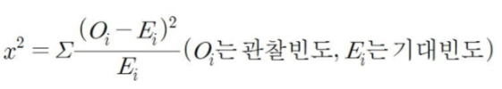

# 210611 수업내용 정리

## CRSIP-DM

CRISP-DM(Cross Industry Standard Process for Data Mining)은 데이터 마이닝 전문가가 사용하는 일반적인 접근 방식을 설명한 가장 널리 사용되는 공개 표준 분석 모델이다.


### Business Understanding(비즈니스 이해)

\- 각종 참고 자료와 현업 책임자와의 커뮤니케이션을 통해 비즈니스를 이해하는 단계

\- 수행업무 : 업무 목적 파악, 상황 파악, 데이터 마이닝 목표 설정, 프로젝트 계획 수립


### Data Understanding(데이터 이해)

\- 분석을 위한 데이터를 수집 및 속성을 이해하고, 문제점을 식별하며 숨겨져 있는 인사이트 발견하는 단계

\- 수행업무 : 초기 데이터 수집, 데이터 기술 분석, 데이터 탐색, 데이터 품질 확인


### Data Preparation(데이터 준비)

\- 데이터 정제, 새로운 데이터 생성 등 자료를 분석 가능한 상태로 만드는 단계(많은 시간이 소요 될 수 있음)

\- 수행업무 : 분석용 데이터 셋 선택, 데이터 정제, 데이터 통합, Training/Test 데이터 분리 등


### Modeling(모델링)

\- 다양한 모델링 기법과 알고리즘을 선택하고 파라미터를 최적화 하는 단계

\- 모델링 결과를 검증용 데이터 데이터로 평가하여 과적합(Over-Fitting) 문제를 추가 확인

\- 수행업무 : 모델링 기법 선택, 모델 테스트 계획 설계, 모델 작성, 모델 평가


### Evaluation(평가)

\- 모형의 해석 가능 여부 및 결과가 프로젝트 목적에 부합하는지 평가하며 결과를 수용할 것인지 판단하는 단계

\- 수행업무 : 분석결과 평가, 모델링 과정 평가, 모델 적용성 평가


### Deployment(전개)

\- 모델링과 평가 단계를 통해 완성된 모델을 업무에 적용하기 위한 계획 수립

\- 모니터링과 모델의 유지보수 계획을 마련하고 각 관리자에게 전달하여 필요한 조치를 취하며 검토가 완료된 모형을 현업에 적용

\- 수행업무 : 전개 계획 수립, 모니터링과 유지보수 계획 수립, 프로젝트 종료 보고서 작성, 프로젝트 리뷰


Reference :

https://needjarvis.tistory.com/512 [자비스가 필요해]


## 실습 (KBinsDiscretizer)

```
>>> X = [[-2, 1, -4,   -1],
...      [-1, 2, -3, -0.5],
...      [ 0, 3, -2,  0.5],
...      [ 1, 4, -1,    2]]
>>> est = KBinsDiscretizer(n_bins=3, encode='ordinal', strategy='uniform')
>>> est.fit(X)
KBinsDiscretizer(...)
>>> Xt = est.transform(X)
>>> Xt  
array([[ 0., 0., 0., 0.],
       [ 1., 1., 1., 0.],
       [ 2., 2., 2., 1.],
       [ 2., 2., 2., 2.]])
```

Reference :

https://scikit-learn.org/stable/modules/generated/sklearn.preprocessing.KBinsDiscretizer.html

https://pyts.readthedocs.io/en/stable/generated/pyts.preprocessing.KBinsDiscretizer.html


## 변수 선택(Feature selection)

### 카이제곱검정(Chi square test)

카이제곱검증은 범주형 자료의 집단간의 동질성 여부를 통계적으로 검증하거나 두 변인간의 상관성을 통계적으로 검증하고자 할때 사용

예) 남자/여자와 같은 범주형 자료의 특성에 따른 선호 비율의 차이나 특정 성향의 연관성을 파악하는데 사용함

설문조사 결과표를 아래와 같이 구분해서 빈도표를 작성하고 이를 바탕으로 분석하는 방법이 카이제곱 검정이라고 보면됨

|      | 독서실 |  집  |
| :--: | :----: | :--: |
| 남자 |   9    |  6   |
| 여자 |   6    |  7   |

즉 수집하는 데이터가 위처럼 범주형 자료이고 이에 따른 상관성이 있는지 알고 싶다면 카이제곱 검정을 시행

단, 아래의 3가지 조건을 갖췄을 때만 카이제곱 검정을 시행할 수 있음


- 카이제곱 검정의 가설

1. 연구가설의 종속변인은 범주형 자료여야 한다

   ex) 몸무게와 같은 자료가 있다면 이를 그룹화(50kg 이하/ 50~60kg / 60~70kg/ 70kg 이상) 하여서 나누거나 저체중, 표준체중, 과체중으로 범주형 자료로 바꾸어 사용해야 함

2. 기대빈도가 5이하인 셀의 전체의 20%가 넘지않아야 한다

   많이 사용하는 2x2형태의 분할표에서는 한셀만 기대빈도가 5미만이어도 카이제곱 검정을 사용할 수 없다

   만약 내가 갖고 있는 자료가 2번째 가정을 어긴다면, 아래와 같은 방법으로 해결할 수 있다.

   - 표본의 크기를 늘린다.

   - 그룹화 시킬 수 있는 항목을 더 그룹화해서 빈도수가 낮은 낮은 셀을 줄인다.
   - 1/2의 방법으로도 어렵다면 Fisher의 정확한 검정을 사용

3. 빈도표에 있는 각칸의 빈도는 다른칸의 빈도와 독립적이어야 한다.

관찰도수와 기대도수의 차이를 평가하기 위한 검정 통계량이므로 관찰치와 기대치의 차이에 대한 제곱을 기대 도수로 나눈 수치의 합




Reference :

https://m.blog.naver.com/PostView.naver?isHttpsRedirect=true&blogId=moses3650&logNo=221192466252

https://www.youtube.com/watch?v=vusSCU-gn4A


## Overfitting, Underfitting

- Overfitting

  모델이 지나치게 학습데이터에 피팅되어서 (문제점) 실제 데이터에 모델이 효과적으로 퍼포먼스를 못 보여줌

- Underfitting

  모델이 학습데이터를 통해 충분히 학습되지 않아서 모델 factor 조정 혹은 데이터 조정이 필요한 상황

