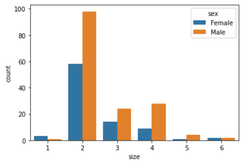
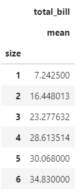
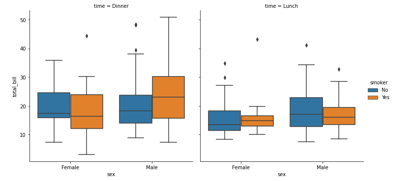
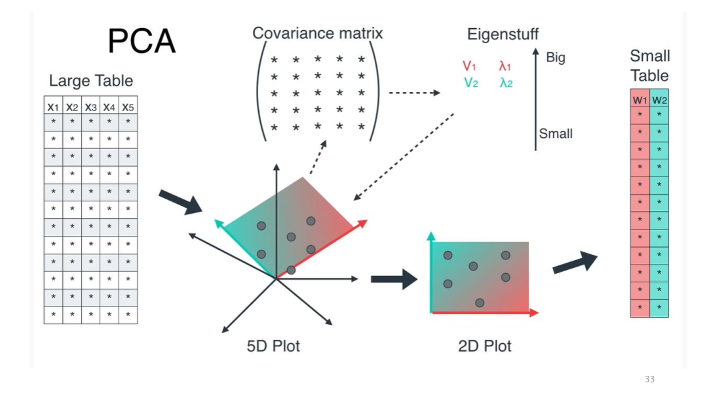

# Data Understanding  (DataBase)

이 자료는 정준수 강사님의 강의를 바탕으로 작성한 것입니다.

강의날짜 : 2021.6.14 ~ 6.17


*The goal of a model is to privde a simple low-dimensional summary of dataset - Hadley Wickham*


## 데이터베이스

데이터베이스는 여러사람에 의해 공유되어 사용할 목적으로 통합하여 관리되는 데이터의 집합, 줄여서 DB라고 말함

관계형 데이터베이스(RDBMS)는 데이터를 로우(Row : 행), 컬럼(Colume : 열)과 같이 일종의 표 형태로 저장하고 종속성은 관계(Relation)로 표현함

컬럼의 구조와 데이터의 관계가 테이블 스키마(Schema)로 사전 정의되고, SQL(구조화 질의 언어)에 의해서 정교한 검색 쿼리를 제공하며 상상하는 거의 모든 방식으로 데이터를 다룰 수 있게 됨


## SQL

- 2차원의 정형데이터를 다루는 가장 효율적인 언어
- Data의 처리 과정을 기술하는 방법이 아닌 원하는 Data의 요건을 기술하는 방식
- Data의 요건이 기술된 요건 정의서 형태이므로 요건의 변경시 적은 수정으로 요건을 반영할 수 있음


### 기본 문법

'SQL로 맛보는 데이터 전처리 분석' 교재 기준으로 기술


- 주의 :  SQL 종료시 반드시 File 에서 Close Connection Tab (Ctrl+Shift+F4)로 종료할 것

  

#### SELECT

- SELECT : 선택하고자 하는 속성목록을 기술

  SELECT 칼럼, 계산값

  ```sql
  # 쿼리란 데이터베이스에 정보를 요청하는 것
  
  ## SELECT
  
  # 칼럼조회
  SELECT customerNumber FROM classicmodels.customers;
  
  # 집계함수
  SELECT SUM(AMOUNT),COUNT(checkNumber) FROM classicmodels.payments;
  
  # *(모든결과조회)
  SELECT * FROM classicmodels.payments;
  SELECT productName, productLine FROM classicmodels.products;
  
  # AS 칼럼 명을 변경해 조회
  SELECT count(productCode) AS N_PRODUCTS, 
  COUNT(productCode) N_PRODUCTS 
  FROM classicmodels.products;
  
  # DISTINCT 중복을 제외하고 데이터 조회
  SELECT DISTINCT orderNumber FROM classicmodels.orderDetails;
  ```


#### FROM

- FROM : Source Data Set을 기술

  FROM 테이블 명

  ```sql
  ## FROM 테이블명
  # 두가지 방식으로 사용
  # 1) SELECT 계산식 또는 칼럼 명 FROM DB 명.SALES;
  # 2) USE DB 명; SELECT 계산식 또는 칼럼 명 FROM SALES;
  ```


#### WHERE

- WHERE: 선택하고자 하는 행의 조건의 목록을 기술

  WHERE 조건

  ```sql
  ## WHERE 조건
  SELECT customerNumber FROM classicmodels.customers where country='USA';
  SELECT * FROM classicmodels.customers where country='USA';
  
  # BETWEEN 시작점 AND 끝점
  SELECT * FROM classicmodels.orderdetails WHERE priceEach BETWEEN 30 AND 50;
  
  # 대소 관계 표현
  SELECT * FROM classicmodels.orderdetails WHERE priceEach >= 30;
  
  # IN (값, 값2) => 값1 또는 값2 출력
  SELECT customerNumber FROM classicmodels.customers WHERE country IN ('USA', 'Canada');
  
  # NOT IN (값1, 값2)
  SELECT customerNumber FROM classicmodels.customers WHERE country NOT IN ('USA', 'Canada');
  
  # IS NULL 결측치(NULL) 처리
  SELECT employeeNumber FROM classicmodels.employees WHERE reportsTo IS NULL;
  SELECT employeeNumber FROM classicmodels.employees WHERE reportsTo IS NOT NULL; # NULL이 아닌 것만 출력하고 싶을 때
  
  # LIKE '%TEXT%' TEXT가 들어간 데이터를 조회하고 싶을때
  SELECT addressLine1 FROM classicmodels.customers WHERE addressLine1 LIKE '%ST%';
  ```


#### GROUP BY

- GROUP BY: 집계하고자 하는 기준속성목록을 기술

  GROUP

  BY 그룹화

  ```sql
  ## GROUP BY 그룹화
  
  # 집계함수 활용 => 집계함수 AVG(), COUNT(), SUM()
  SELECT country, city, count(customerNumber) N_COUSTOMERS FROM classicmodels.customers GROUP BY country, city;
  
  # 집계 함수에 CASE WHEN 구문 사용
  select sum(case when country = 'USA' then 1 else 0 end) N_USA, sum(case when country = 'USA' then 1 else 0 end)/count(*) USA_PORTION
  from classicmodels.customers;
  
  # 교재 외 연습내용
  use classicmodels;
  show tables;
  select * from employees;
  select firstName from employees;
  select firstName, lastName from employees;
  select employeeNumber, firstName, lastName from employees where employees.employeeNumber >= 1300;
  select * from offices;
  select city from offices where offices.officeCode='1';
  select city, phone from offices where offices.officeCode='1';
  ```


#### JOIN

- JOIN => 테이블 결합함수

  ```sql
  # LEFT JOIN => FROM 절의 테이블 기준으로 매칭되는 정보 호출
  select a.orderNumber, b.country from classicmodels.orders A LEFT JOIN classicmodels.customers B ON a.customerNumber = b.customerNumber
  select a.orderNumber, b.country from classicmodels.orders A LEFT JOIN classicmodels.customers B ON a.customerNumber = b.customerNumber
  where b.country = 'USA';
  
  # INNER JOIN => 교집합만 출력
  select a.orderNumber, b.country from classicmodels.orders A INNER JOIN classicmodels.customers B ON a.customerNumber = b.customerNumber
  where b.country = 'USA';
  
  # FULL JOIN => 거의 사용하지 않음
  ```


#### CASE WHEN

- SELECT CASE WHEN 조건 1 TEHN 결과1

  WHEN 조건 2 THEN 결과 2 ELSE 결과 3 END
  
  FROM 데이터베이스.테이블 명;
  
  ```sql
    ## CASE WHEN
    select country, case when country in ('USA', 'Canada') then 'North Ameria' else 'Others' end as region from classicmodels.customers;
  
    select case when country in ('USA', 'Canada') then 'North Ameria' 
    else 'Others' end as region, 
    count(customerNumber) N_customer 
    from classicmodels.customers
    group
    by case when country in ('USA', 'Canada') then 'North Ameria' else 'Others' end;
  
    select case when country in ('USA', 'Canada') then 'North Ameria' 
    else 'Others' end as region, 
    count(customerNumber) N_customer 
    from classicmodels.customers
    group
    by 1;
  ```


## 데이터 분석을 위한 파이썬 연동 SQL 사용 실습  

### MySQL DB 모듈 설치

Python에서 MySQL 데이터베이스를 사용하기 위해 우선 Python DB API 표준을 따르는 MySQL DB 모듈을 다운받아 설치한다.

MySQL DB 모듈 중 하나인 **PyMySql 모듈**을 Anaconda Powershell Prompt (anaconda3)에서 설치한다.

```shell
$ pip install PyMySQL
```


### MySql 사용 절차

1. PyMySql 모듈을 import 한다.

   ```python
   import pymysql.cursors
   ```

   

2. pymysql.connect() 메소드를 사용하여 MySQL에 Connect 한다. 호스트명, 로그인, 암호, 접속할 DB 등을 파라미터로 지정한다.

   ```python
   connection = pymysql.connect(host='localhost',
           user='root',
           password='1234',
           db='tip',
           charset='utf8',
           cursorclass=pymysql.cursors.DictCursor)
   ```

3. DB 접속이 성공하면, Connection 객체로부터 cursor() 메서드를 호출하여 Cursor 객체를 가져온다. DB 커서는 Fetch 동작을 관리하는데 사용되는데, 만약 DB 자체가 커서를 지원하지 않으면, Python DB API에서 이 커서 동작을 Emulation 하게 된다.

4. Cursor 객체의 execute() 메서드를 사용하여 SQL 문장을 DB 서버에 보낸다. SQL 쿼리의 경우 Cursor 객체의 fetchall(), fetchone(), fetchmany() 등의 메서드를 사용하여 데이타를 서버로부터 가져온 후, Fetch 된 데이터를 사용한다.

   ```python
   try:
       with connection.cursor() as cursor:
           sql = "SELECT total_bill FROM tip.tips where tip >= 7;"
           cursor.execute(sql)
   
           result = cursor.fetchone()
           print(result)
   ```

5. Connection 객체의 close() 메서드를 사용하여 DB 연결을 닫는다.

   ```python
   finally:
       connection.close()
   ```


source : 

- sql_basic.sql
- python_db.ipynb
- tips.csv


Reference : http://pythonstudy.xyz/python/article/202-MySQL-%EC%BF%BC%EB%A6%AC


### SQL과 python 비교 예시

Reference : https://pandas.pydata.org/pandas-docs/stable/getting_started/comparison/comparison_with_sql.html#compare-with-sql


실습 파일 : tips_pandas.ipynb

source : 

- tips.csv

### SQL python 연동 후 결측치에 평균값 채우기 실습


```python
# MySQl DB에서 데이터 받아와서 DataFrame에 저장

conn = pymysql.connect(host='localhost', user='root',
                       password='1281', db='classicmodels', charset='utf8',
                       autocommit=True, cursorclass=pymysql.cursors.DictCursor)

sql = 'select customers.customerNumber, customers.salesRepEmployeeNumber, payments.checkNumber from customers LEFT JOIN payments on customers.customerNumber = payments.customerNumber;'

try:
    with conn.cursor() as curs:
        curs.execute(sql)
        rs = curs.fetchall()        
        # DB에서 받아온 값을 DataFrame에 넣음
        df = pd.DataFrame(rs)
        print(df)
        
        # df.to_svv('query.csv')
finally:
    conn.close()
    
df.isnull().sum()
df.values

data = df.values
ix = [i for i in range(data.shape[1]) if i !=3]
ix

X = data[:,:2]
X

from sklearn.impute import SimpleImputer

imputer = SimpleImputer(strategy='mean')

# fit on the dataset
imputer.fit(X)

# transform the dataset
Xtrans = imputer.transform(X)

Xtrans
```


실습파일 : classicmodel1.ipynb


## 데이터 시각화

### matplotlib

파이썬으로 기본적인 차트들을 쉽게 그릴 수 있도록 도와주는 가장 유명한 데이터 시각화 라이브러리

실습파일 : plot.ipynb


### seaborn

Seaborn은 Matplotlib을 기반으로 다양한 색상 테마와 통계용 차트 등의 기능을 추가한 시각화 패키지이다. 

`barplot`, `violinplot`, `boxplot` 등 에서는 두 가지 카테고리 값에 의한 실수 값의 변화를 보기 위한 `hue` 인수를 제공한다. `hue` 인수에 카테고리 값을 가지는 변수의 이름을 지정하면 카테고리 값에 따라 다르게 시각화된다. 

실습파일 : seabron1.ipynb

reference : https://datascienceschool.net/01%20python/05.04%20%EC%8B%9C%EB%B3%B8%EC%9D%84%20%EC%82%AC%EC%9A%A9%ED%95%9C%20%EB%8D%B0%EC%9D%B4%ED%84%B0%20%EB%B6%84%ED%8F%AC%20%EC%8B%9C%EA%B0%81%ED%99%94.html


### **어떤 그래프를 써야할까?**

- 우선 분석할 데이터셋의 attributes 를 파악해야함
  - 어떤 attribute 가 numeric 인지, categorical 인지, 시간인지

  - 빠진 데이터가있는지

  - attribues 끼리의 연관성

    

- attributes 을 파악 후에는 데이터의 성질에따라 어떤 플롯을 쓸지 고민해보는 것이 좋다.
  - 시간에 따른 변화 -> line, area, bar

    ```python
    sns.lineplot(data=flights, x='year', y='passengers')
    ```

  - 비교와 랭킹 -> bar

    ```python
    sns.barplot(x="abbrev", y="total", data=crashes, color="b")
    ```

  - 연관성 -> scatter

    ```python
    sns.scatterplot(data=penguins, x="flipper_length_mm", y="body_mass_g")
    ```

  - 분포 -> box plot, histogram

    ```python
    plt.subplots(figsize=(10, 5))
    sns.boxplot(x="day", y="total_bill", data=tips, hue = "sex")
    ```


reference : https://github.com/codestates/ds-blog/issues/79

https://and-some.tistory.com/187

### tip.csv 데이터 분석


- 목표변수

1. 매출
2. 팁
3. 요일별 팀 Size 수
4. Tip rate
5. 요일별 방문 예상 팀 수


- 분석내용 (고아름 주관)

  남성비중은 64 %, 여성비중은 35 % 

  남성이 약간 더 팁을 많이 주는 경향이 있었다. 

  낮보단 저녁에 팁을 많이 주는 경향이 있다. 

  인원수가 많은 수록 팁을 많이 주는 경향이 있다.

  비흡연자가 흡연자보다 팁을 많이 주는 경향이 있다.

  팁 비중을 보았을 때 남성이 더 많이 주는 경향이 있다.

  팁 비중을 기준으로 인원이 2명일 경우 가장 많이 팁을 주었다.

  금액에 따른 팁 비중은 일정한 편이였다.

  주말동안 남성비중이 높으며,  인원수가 2명인 경우가 가장 많음.

  주말동안 평균 약 20달러정도 매출이 발생함.


- 분석결과  (고아름 주관)

  손님의 남성비중은 64 %, 여성비중은 35 %으로 나타난다.  

  ```python
  tips.sex.value_counts(normalize = True)
  ```

  ```
  Male      0.643443
  Female    0.356557
  Name: sex, dtype: float64
  ```

  

  목,금,토,일 중 토요일의 비중은 37%, 일요일의 비중은 31%로 나타나 주말 비중이 68%으로 주말 손님이 많은 것으로 나타난다. 

  ```python
  tips.day.value_counts(normalize = True)
  ```

  ```
  Sat     0.356557
  Sun     0.311475
  Thur    0.254098
  Fri     0.077869
  Name: day, dtype: float64
  ```

  

  인원수는 2명인 경우가 가장 높은 것으로 나타난다.

  ```python
  sns.countplot(x = 'size', hue = 'sex', data = tips )
  plt.show()
  ```

  

  

  인원수 3명 이상 부터는 평균 지불금액이 큰 차이가 없다.  

  ```python
  total_bill_mean = tips.groupby(["size"]).agg({"total_bill": [np.mean]})
  total_bill_mean
  ```

  

  

  점심과 저녁의 지불금액을 비교할 경우 저녁의 경우가 높다. 

  ```python
  sns.catplot(x="sex", y="total_bill",
                    hue="smoker", col="time",
                    data=tips, kind="box")
  ```

  

  

  따라서 매출증대를 위해 저녁시간대 인원수 2명의 남성을 위한 마케팅전략이 필요하다.

## Feature Selection 실습

실습파일:

- [target_total_bill.ipynb](https://github.com/goareum93/K-digital-training/blob/master/06_SQL/04_feature_selection/target_total_bill.ipynb)
- [target_tip.ipynb](https://github.com/goareum93/K-digital-training/blob/master/06_SQL/04_feature_selection/target_tip.ipynb)


- Feature selection 이란?

  - 불분명한 관계없는 feature를 머신러닝 모델 트레이닝에 쓰면 negative impact를 준다.
  - 사이킷런 라이브러리를 활용함으로 feature selection을 automatic하게 찾을 수 있다.
  - Feature selection을 써서 오버 피팅(Overfitting)문제를 낮춘다. 불필요한 데이터를 적게(Less Redundant data)사용하여 적은 확률로 노이즈에 관한 판단을 한다.
  - Feature selection으로 정확도를 올릴 수 있고, 트레이닝 시간을 줄일 수 있다.

  


## RFE (Recursive Feature Elimination)

- 반복적으로 피쳐를 지움으로써 남겨진 피쳐를 사용한다.

  

## PCA(Principal Component Analysis)

- 

  

## 실습

### Target : Total bill -> PCA without Mutate Variable tip rate 


### Target : Total bill ->  RFA without Mutate Variable tip rate 


### Target : Total bill ->  Regression Feature Selection without Mutate Variable tip rate 


### Normalize


## Standardization


