# Django

2021.06.23~24일 수업내용 기준으로 작성한 것입니다.


## 설치하기

anaconda Powershell에서 다음과 같이 작성

```powershell
  conda deactivate

  conda create --name django python=3.8.3

  conda env list

  conda activate django

  pip install ipykernel

  python -m ipykernel install --user --name django --display-name "Python Django"

  conda install -c conda-forge jupyterlab
  
  # Django installation
    pip install Django==3.2.4
    
python -m django --version

cd Desktop

cd 2021-K-Digital-Training-main
# 바탕화면에 저 폴더가 있어야 이게 실행돼요! 확인!!

django-admin startproject mysite

dir
#mysite 있는지 확인

cd mysite

python manage.py
```


vs code를 열어서 mysite 폴더를 오픈한다.

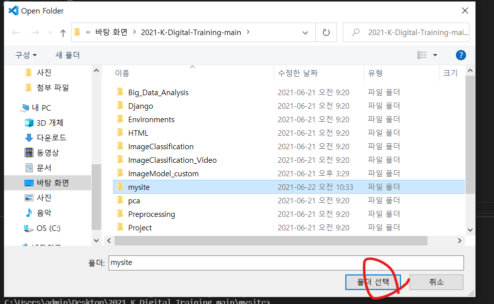

vs code에서 +밑에 v 아래 화살표 표시를 눌러  command prompt 저거 누른다

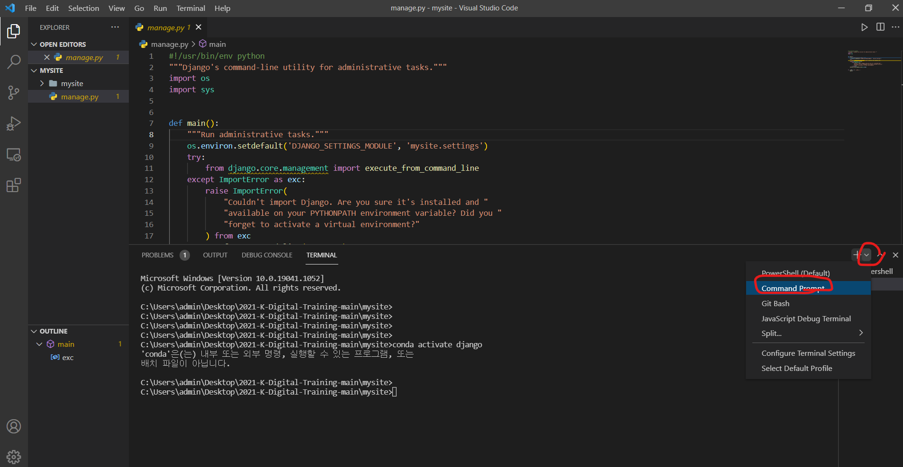

```
conda activate django
```

위의 코드를 실행시키면 아래와 같이 (django)로 활성화 된것을 확인할 수 있다.

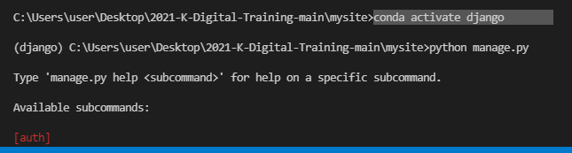


단, 아래의 오류가 났을 경우 anaconda의 경로 설정 문제가 있었을지도 모른다. 

```
C:\Users\admin\Desktop\2021-K-Digital-Training-main\mysite>conda activate django
'conda'은(는) 내부 또는 외부 명령, 실행할 수 있는 프로그램, 또는
배치 파일이 아닙니다.
```

그렇다면 아래와 같이 환경변수에 Anaconda 경로를 넣어줘야한다. 

- 시작버튼 누르고 시스템 환경변수 편집을 검색하고 고급에서 환경변수를 클릭

- Path를 누르고 편집 클릭

- 그리고 아래 그림에 나타나 있는 Anaconda 관련 코드를 작성하면 된다. 단, 개인별로 admin 이라고 쓴 폴더명이 다를수 있으니 체크하기!

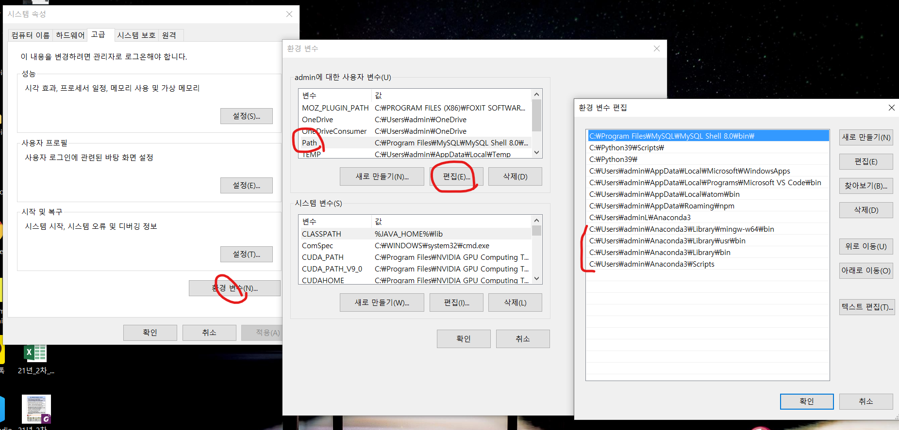

- 다시 vs code로 돌아가서 command prompt 에 `conda activate django`를 실행시켜보면 (django)로 활성화 된것을 확인할 수 있다.


## 장고 앱 작성

### 프로젝트 만들기

django 홈페이지에 나타난 앱 작성하기 예시를 따라할 것이다.

https://docs.djangoproject.com/ko/3.2/intro/tutorial01/

이 튜토리얼을 통해, 간단한 설문조사(Polls) 어플리케이션을 만드는 과정을 따라해 보자.

다음 명령을 실행하여 Django가 설치되어 있고 어떤 버전인지 알 수 있다.

```shell
$ python -m django --version
```

 `cd` 명령으로 코드를 저장할 디렉토리로 이동 한 후, 다음의 명령을 수행한다.

```shell
$ django-admin startproject mysite
```

이 명령은 현재 디렉토리에서 `mysite`라는 디렉토리를 생성할 것이다.

### 개발 서버

당신의 Django 프로젝트가 제대로 동작하는지 확인해보자. `mysite` 디렉토리로 이동하고, 다음 명령어를 입력

```shell
$ python manage.py runserver
```

이제 서버가 동작하기 시작했으니, 자신의 웹 브라우져에서 http://127.0.0.1:8000/ 을 통해 접속할 수 있다. 로켓이 이륙하는 모습이 담긴 《Congratulations!》 페이지를 보게된다.

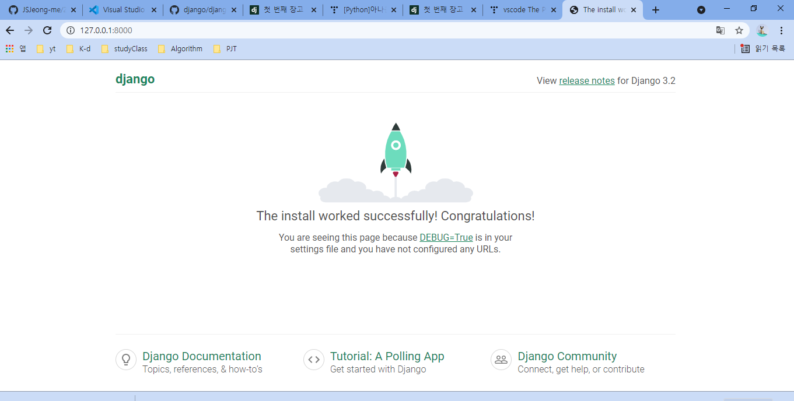


앱을 생성하기 위해 `manage.py`가 존재하는 디렉토리에서 다음의 명령을 입력해 보자.

```shell
$ python manage.py startapp polls
```

dir를 통해 안에 어떤파일들이 생겼는지 파악해보자.


### 첫 번째 뷰 작성하기

첫 번째 뷰를 작성해보자. 《polls/view.py》를 열어 다음과 같은 파이썬 코드를 입력

```shell
from django.http import HttpResponse


def index(request):
    return HttpResponse("Hello, world. You're at the polls index.")
```

Django에서 가장 간단한 형태의 뷰이다. 뷰를 호출하려면 이와 연결된 URL 이 있어야 하는데, 이를 위해 URLconf가 사용됨

polls 디렉토리에서 URLconf를 생성하려면, `urls.py`라는 파일을 생성해야 합니다. 


《polls/urls.py》 파일에는 다음과 같은 코드가 포함되어 있습니다.

```
from django.urls import path

from . import views

urlpatterns = [
    path('', views.index, name='index'),
]
```

다음 단계는, 최상위 URLconf 에서 `polls.urls` 모듈을 바라보게 설정합니다. 

`mysite/urls.py` 파일을 열고, `django.urls.include`를 import 하고, `urlpatterns` 리스트에 [`include()`](https://docs.djangoproject.com/ko/3.2/ref/urls/#django.urls.include) 함수를 다음과 같이 추가합니다.

```shell
from django.contrib import admin
from django.urls import include, path

urlpatterns = [
    path('polls/', include('polls.urls')),
    path('admin/', admin.site.urls),
]
```


### 데이터베이스 설치

참고 : https://docs.djangoproject.com/ko/3.2/intro/tutorial02/

이제, `mysite/settings.py` 파일을 열어보세요. 이 파일은 Django 설정을 모듈 변수로 표현한 보통의 Python 모듈입니다.

다른 데이터베이스를 사용해보고 싶다면, 적절한 [데이터베이스 바인딩](https://docs.djangoproject.com/ko/3.2/topics/install/#database-installation)을 설치하고, 데이터베이스 연결 설정과 맞게끔 [`DATABASES`](https://docs.djangoproject.com/ko/3.2/ref/settings/#std:setting-DATABASES) `'default'` 항목의 값을 다음의 키 값으로 바꿔주세요.

- [`ENGINE`](https://docs.djangoproject.com/ko/3.2/ref/settings/#std:setting-DATABASE-ENGINE) – `'django.db.backends.sqlite3'`, `'django.db.backends.postgresql'`, `'django.db.backends.mysql'`, 또는 `'django.db.backends.oracle'`. 그외에 [서드파티 백엔드](https://docs.djangoproject.com/ko/3.2/ref/databases/#third-party-notes) 참조.


저는 mysql을 불러올꺼기 때문에 엔진을 `'django.db.backends.mysql'`라고 하고 데이터의 이름 `tip`, user에 `root`, 비밀번호, HOST, PORT를 그림과 같이 작성합니다. 

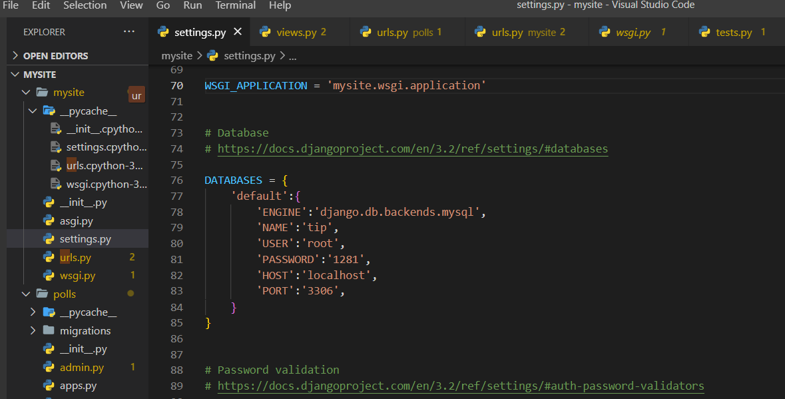

참고 : https://docs.djangoproject.com/en/3.2/ref/settings/#databases


기본 어플리케이션들 중 몇몇은 최소한 하나 이상의 데이터베이스 테이블을 사용하는데, 그러기 위해서는 데이터베이스에서 테이블을 미리 만들 필요가 있습니다. 이를 위해, 다음의 명령을 실행해봅시다.

```shell
$ python manage.py migrate
```


MySQL에서 새로고침? 버튼을 누르면 아래와 같이 테이블을 불러온 것을 확인할 수 있습니다.

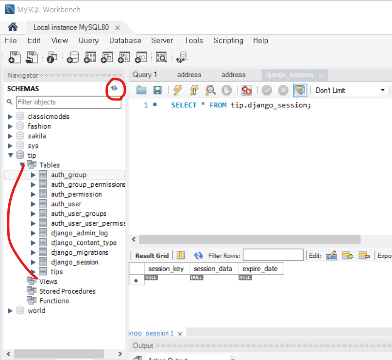


단, MysQL이 연결이 안되는 에러가 발생했을경우에는

- 시작버튼을 눌러 서비스를 검색하고 클릭

- MySQL80을 찾아서 우클릭후 시작버튼을 누르면 됩니다.

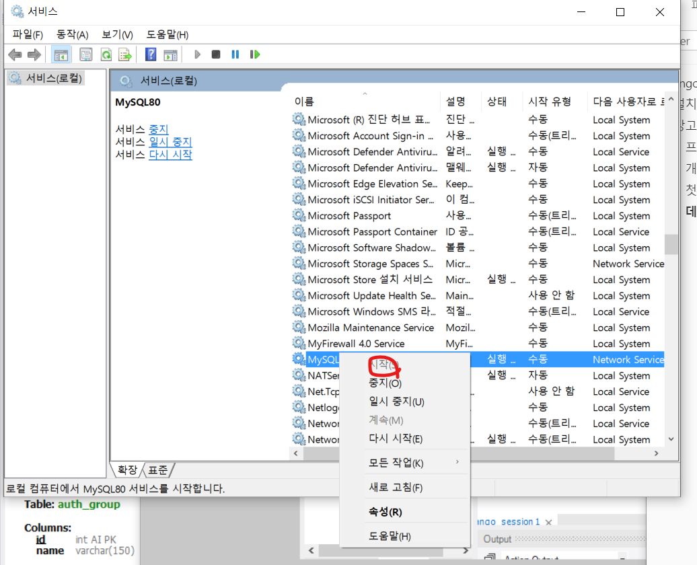


### Superuser 만들기

https://kamang-it.tistory.com/entry/Django-02superuser-%EB%A7%8C%EB%93%A4%EA%B8%B0


django에서는 특정 프로젝트에 대해서 user그룹이란게 존재한다.

마치 db의 user와 유사하고 실제로도 그렇다.

맨처음에 유저는 존재치 않는다.

따라서 user를 만들어줘야할 필요성이 있는것이다.

```shell
python manage.py createsuperuser
```

위의 명령어를 사용하면 해당 프로젝트에서 superuser(흔히 말하는 root계정)을 만들 수 있다.

여기서 당신의 이름과 메일, 그리고 패스워드를 입력해주면 완성된다.

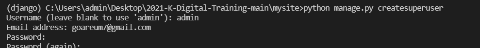


참고로 비밀번호 입력시 보이지 않으며 패스워드가 너무짧으면 Bypass~? [y/N]가 나오는데 y로 하면 짧은대로 된다.

http://127.0.0.1:8000/admin/


vs code command prompt에서 아래 코드를 작성한다.

```
python manage.py runserver 
```

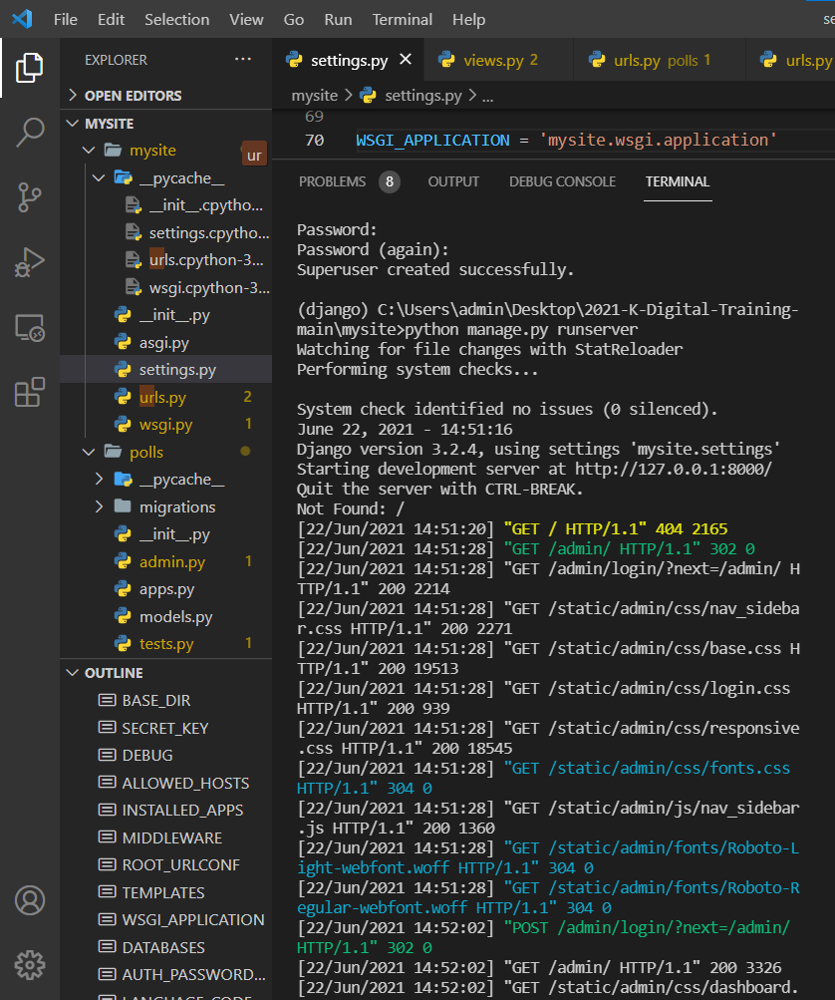


여기로 들어가게 되면 아래와 같은 화면이 나오고 User을 클릭한다.

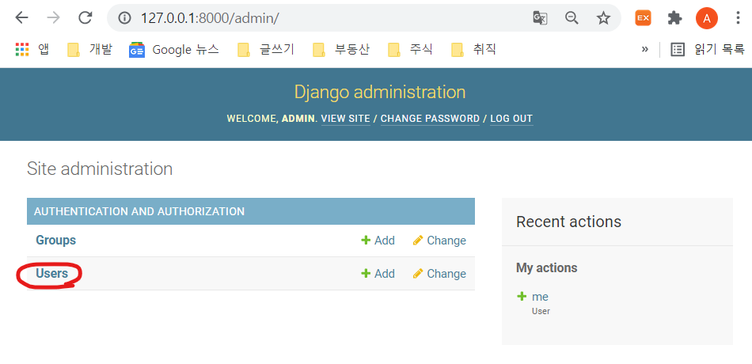

add user을 누르고 

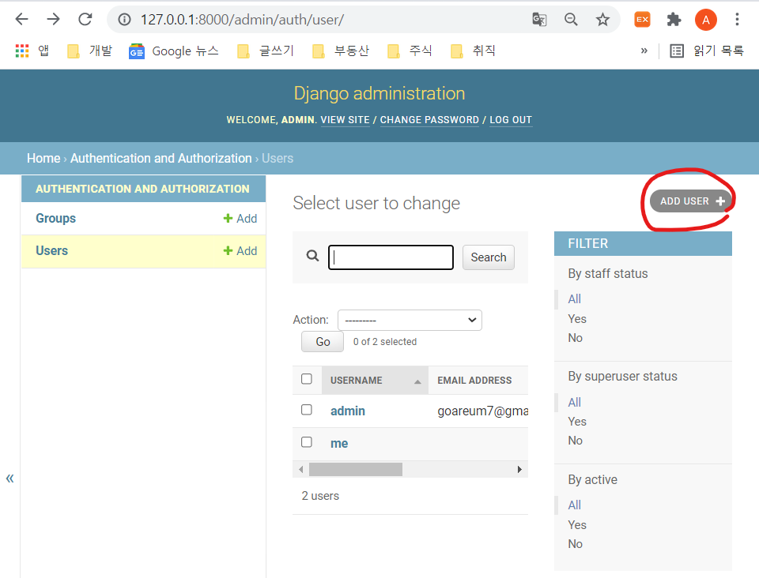


새로운 username과 password를 작성했다.

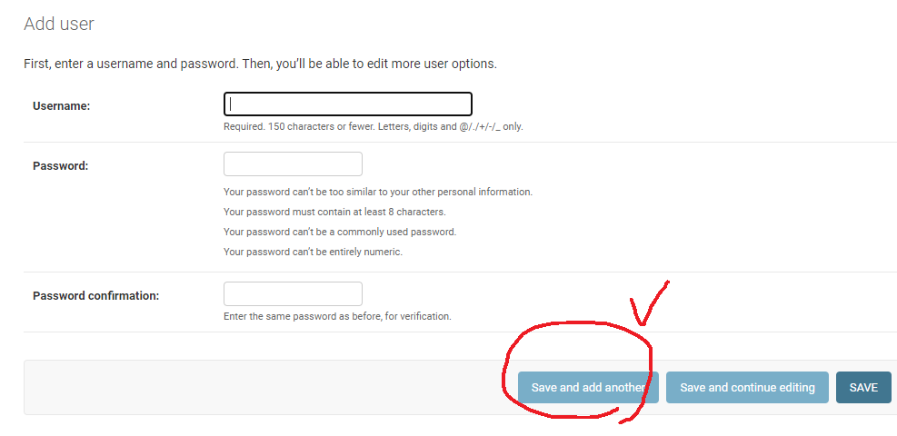

나의경우 me로 작성했는데 아래와 같이 생성된것을 확인할 수 있다.

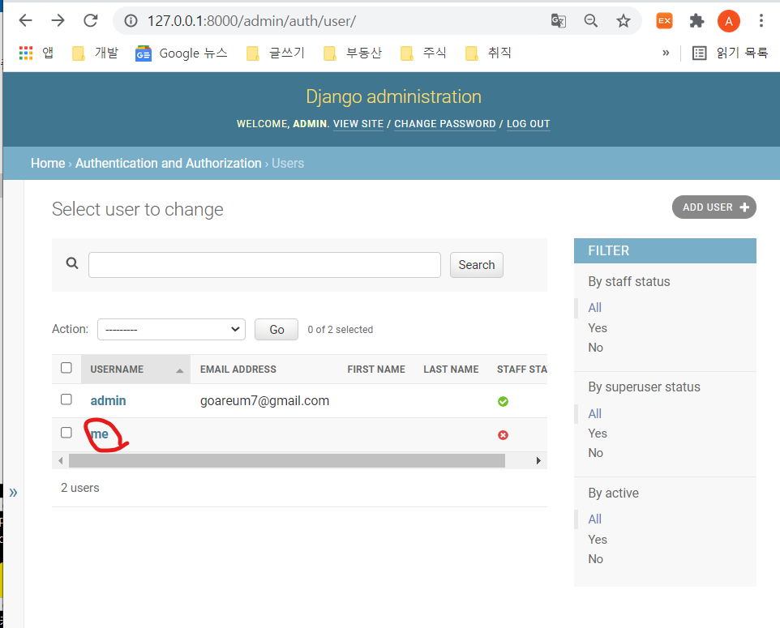


### 모델만들기

이제, 모델을 정의해 보겠습니다. 본질적으로, 모델이란 부가적인 메타데이터를 가진 데이터베이스의 구조(layout)를 말합니다.


polls/models.py 파일에 아래 코드를 작성한다.

```shell
from django.db import models


class Question(models.Model):
    question_text = models.CharField(max_length=200)
    pub_date = models.DateTimeField('date published')


class Choice(models.Model):
    question = models.ForeignKey(Question, on_delete=models.CASCADE)
    choice_text = models.CharField(max_length=200)
    votes = models.IntegerField(default=0)
```


### 모델의 활성화

모델에 대한 이 작은 코드가, Django에게는 상당한 양의 정보를 전달합니다. Django는 이 정보를 가지고 다음과 같은 일을 할 수 있습니다.

- 이 앱을 위한 데이터베이스 스키마 생성(`CREATE TABLE` 문)
- `Question`과 `Choice` 객체에 접근하기 위한 Python 데이터베이스 접근 API를 생성

그러나, 가장 먼저 현재 프로젝트에게 `polls` 앱이 설치되어 있다는 것을 알려야 합니다.


앱을 현재의 프로젝트에 포함시키기 위해서는, 앱의 구성 클래스에 대한 참조를 [`INSTALLED_APPS`](https://docs.djangoproject.com/ko/3.2/ref/settings/#std:setting-INSTALLED_APPS) 설정에 추가해야 합니다. `PollsConfig` 클래스는 `polls/apps.py` 파일 내에 존재합니다. 따라서, 점으로 구분된 경로는 `'polls.apps.PollsConfig'`가 됩니다. 이 점으로 구분된 경로를, `mysite/settings.py` 파일을 편집하여 [`INSTALLED_APPS`](https://docs.djangoproject.com/ko/3.2/ref/settings/#std:setting-INSTALLED_APPS) 설정에 추가하면 됩니다. 이는 다음과 같이 보일 것입니다.

```shell
INSTALLED_APPS = [
    'polls.apps.PollsConfig',
    'django.contrib.admin',
    'django.contrib.auth',
    'django.contrib.contenttypes',
    'django.contrib.sessions',
    'django.contrib.messages',
    'django.contrib.staticfiles',
]
```


command 창에서 다음을 입력한다

```shell
$ python manage.py sqlmigrate polls 0001
```

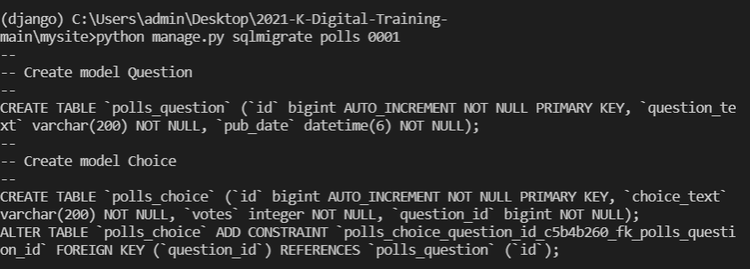

이제, [`migrate`](https://docs.djangoproject.com/ko/3.2/ref/django-admin/#django-admin-migrate) 를 실행시켜 데이터베이스에 모델과 관련된 테이블을 생성

```
$ python manage.py migrate
```

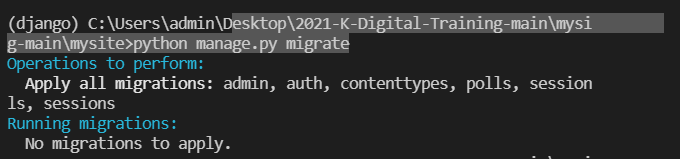


### API 가지고 놀기

이제, 대화식 Python 쉘에 뛰어들어 Django API를 자유롭게 가지고 놀아봅시다. Python 쉘을 실행하려면 다음의 명령을 입력합니다.

```
$ python manage.py shell
```

```shell
>>> from polls.models import Choice, Question  # Import the model classes we just wrote.

# No questions are in the system yet.
>>> Question.objects.all()
<QuerySet []>

# Create a new Question.
# Support for time zones is enabled in the default settings file, so
# Django expects a datetime with tzinfo for pub_date. Use timezone.now()
# instead of datetime.datetime.now() and it will do the right thing.
>>> from django.utils import timezone
>>> q = Question(question_text="What's new?", pub_date=timezone.now())

# Save the object into the database. You have to call save() explicitly.
>>> q.save()

# Now it has an ID.
>>> q.id
1

# Access model field values via Python attributes.
>>> q.question_text
"What's new?"
>>> q.pub_date
datetime.datetime(2012, 2, 26, 13, 0, 0, 775217, tzinfo=<UTC>)

# Change values by changing the attributes, then calling save().
>>> q.question_text = "What's up?"
>>> q.save()

# objects.all() displays all the questions in the database.
>>> Question.objects.all()
<QuerySet [<Question: Question object (1)>]>
```

여기서 잠깐. `<Question: Question object (1)>`은 이 객체를 표현하는 데 별로 도움이 되지 않습니다. (`polls/models.py` 파일의) `Question` 모델을 수정하여, [`__str__()`](https://docs.djangoproject.com/ko/3.2/ref/models/instances/#django.db.models.Model.__str__) 메소드를 `Question`과 `Choice`에 추가해 봅시다.


```shell
from django.db import models

class Question(models.Model):
    # ...
    def __str__(self):
        return self.question_text

class Choice(models.Model):
    # ...
    def __str__(self):
        return self.choice_text
```

이 모델에 커스텀 메소드 또한 추가해봅시다:

```shell
import datetime

from django.db import models
from django.utils import timezone


class Question(models.Model):
    # ...
    def was_published_recently(self):
        return self.pub_date >= timezone.now() - datetime.timedelta(days=1)
```

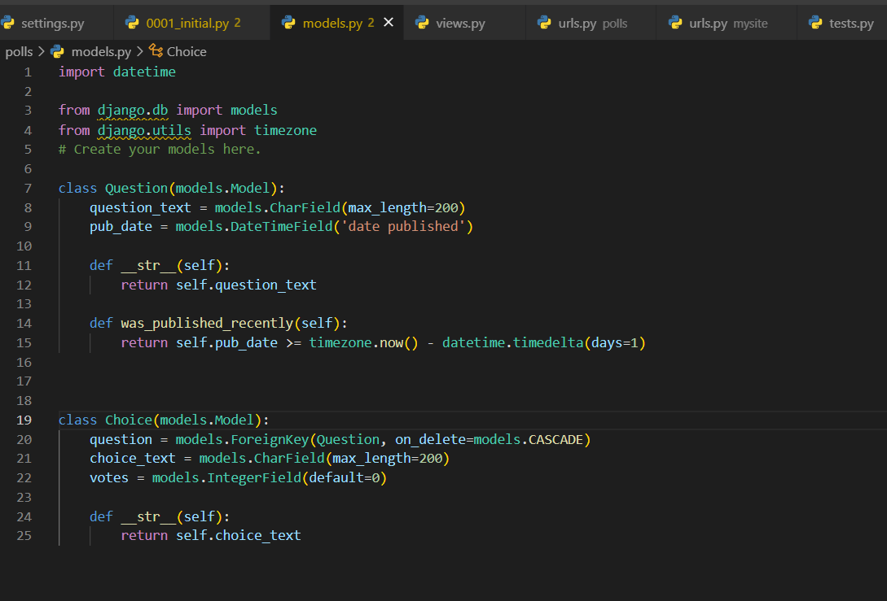

변경된 사항을 저장하고, `exit()` 후`python manage.py shell`를 다시 실행해보세요.

```shell
>>> from polls.models import Choice, Question

# Make sure our __str__() addition worked.
>>> Question.objects.all()
<QuerySet [<Question: What's up?>]>

# Django provides a rich database lookup API that's entirely driven by
# keyword arguments.
>>> Question.objects.filter(id=1)
<QuerySet [<Question: What's up?>]>
>>> Question.objects.filter(question_text__startswith='What')
<QuerySet [<Question: What's up?>]>

# Get the question that was published this year.
>>> from django.utils import timezone
>>> current_year = timezone.now().year
>>> Question.objects.get(pub_date__year=current_year)
<Question: What's up?>

# Request an ID that doesn't exist, this will raise an exception.
>>> Question.objects.get(id=2)
Traceback (most recent call last):
    ...
DoesNotExist: Question matching query does not exist.

# Lookup by a primary key is the most common case, so Django provides a
# shortcut for primary-key exact lookups.
# The following is identical to Question.objects.get(id=1).
>>> Question.objects.get(pk=1)
<Question: What's up?>

# Make sure our custom method worked.
>>> q = Question.objects.get(pk=1)
>>> q.was_published_recently()
True

# Give the Question a couple of Choices. The create call constructs a new
# Choice object, does the INSERT statement, adds the choice to the set
# of available choices and returns the new Choice object. Django creates
# a set to hold the "other side" of a ForeignKey relation
# (e.g. a question's choice) which can be accessed via the API.
>>> q = Question.objects.get(pk=1)

# Display any choices from the related object set -- none so far.
>>> q.choice_set.all()
<QuerySet []>

# Create three choices.
>>> q.choice_set.create(choice_text='Not much', votes=0)
<Choice: Not much>
>>> q.choice_set.create(choice_text='The sky', votes=0)
<Choice: The sky>
>>> c = q.choice_set.create(choice_text='Just hacking again', votes=0)

# Choice objects have API access to their related Question objects.
>>> c.question
<Question: What's up?>

# And vice versa: Question objects get access to Choice objects.
>>> q.choice_set.all()
<QuerySet [<Choice: Not much>, <Choice: The sky>, <Choice: Just hacking again>]>
>>> q.choice_set.count()
3

# The API automatically follows relationships as far as you need.
# Use double underscores to separate relationships.
# This works as many levels deep as you want; there's no limit.
# Find all Choices for any question whose pub_date is in this year
# (reusing the 'current_year' variable we created above).
>>> Choice.objects.filter(question__pub_date__year=current_year)
<QuerySet [<Choice: Not much>, <Choice: The sky>, <Choice: Just hacking again>]>

# Let's delete one of the choices. Use delete() for that.
>>> c = q.choice_set.filter(choice_text__startswith='Just hacking')
>>> c.delete()
```


### 뷰 추가하기

Ref : https://docs.djangoproject.com/ko/3.2/intro/tutorial03/

이제, `polls/views.py` 에 뷰를 추가해 봅시다. 이 뷰들은 인수를 받기 때문에 조금 모양이 다릅니다.

```python
def detail(request, question_id):
    return HttpResponse("You're looking at question %s." % question_id)

def results(request, question_id):
    response = "You're looking at the results of question %s."
    return HttpResponse(response % question_id)

def vote(request, question_id):
    return HttpResponse("You're voting on question %s." % question_id)
```

다음의 [`path()`](https://docs.djangoproject.com/ko/3.2/ref/urls/#django.urls.path) 호출을 추가하여 이러한 새로운 뷰를 `polls.urls` 모듈로 연결하세요.

polls/urls.py[¶](https://docs.djangoproject.com/ko/3.2/intro/tutorial03/#id3)

```shell
from django.urls import path

from . import views

urlpatterns = [
    # ex: /polls/
    path('', views.index, name='index'),
    # ex: /polls/5/
    path('<int:question_id>/', views.detail, name='detail'),
    # ex: /polls/5/results/
    path('<int:question_id>/results/', views.results, name='results'),
    # ex: /polls/5/vote/
    path('<int:question_id>/vote/', views.vote, name='vote'),
]
```

브라우저에 《/polls/5/》 를 입력해 보세요. 이 주소에 접속하면 `detail()` 함수를 호출하여 URL 에 입력한 ID 를 출력할 것입니다. 《/polls/5/results/》 와 《/polls/5/vote/》 도 실행해 보세요. 투표 결과와 투표 페이지의 뼈대가 되는 페이지가 출력될 것입니다.

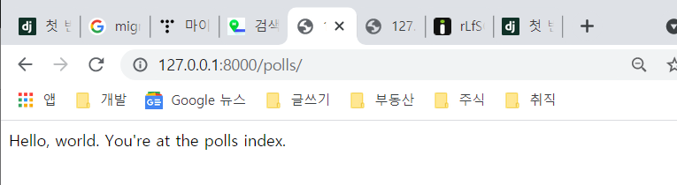

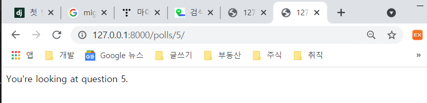

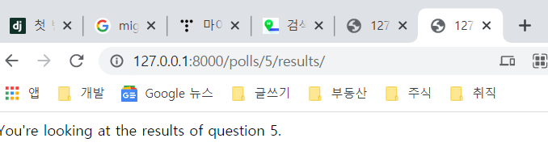

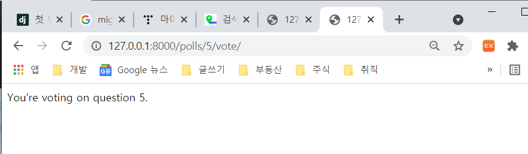


### 뷰가 실제로 뭔가를 하도록 만들기

각 뷰는 두 가지 중 하나를 하도록 되어 있습니다. 요청된 페이지의 내용이 담긴 [`HttpResponse`](https://docs.djangoproject.com/ko/3.2/ref/request-response/#django.http.HttpResponse) 객체를 반환하거나, 혹은 [`Http404`](https://docs.djangoproject.com/ko/3.2/topics/http/views/#django.http.Http404) 같은 예외를 발생하게 해야합니다. 나머지는 당신에게 달렸습니다.

Django에 필요한 것은 [`HttpResponse`](https://docs.djangoproject.com/ko/3.2/ref/request-response/#django.http.HttpResponse) 객체 혹은 예외입니다.

새로운 `index()` 뷰 하나를 호출했을 때, 시스템에 저장된 최소한 5 개의 투표 질문이 콤마로 분리되어, 발행일에 따라 출력됩니다.

polls/views.py 변경

```python
from django.http import HttpResponse

from .models import Question


def index(request):
    latest_question_list = Question.objects.order_by('-pub_date')[:5]
    output = ', '.join([q.question_text for q in latest_question_list])
    return HttpResponse(output)

# Leave the rest of the views (detail, results, vote) unchanged
```

여기 몇가지 문제가 있습니다. 뷰에서 페이지의 디자인이 하드코딩 되어 있다고 합시다. 만약 페이지가 보여지는 방식을 바꾸고 싶다면, 이 Python 코드를 편집해야만 할 겁니다. 그럼, 뷰에서 사용할 수 있는 템플릿을 작성하여, Python 코드로부터 디자인을 분리하도록 Django의 템플릿 시스템을 사용해 봅시다.

우선, `polls` 디렉토리에 `templates`라는 디렉토리를 만듭니다. Django는 여기서 템플릿을 찾게 될 것입니다.

프로젝트의 [`TEMPLATES`](https://docs.djangoproject.com/ko/3.2/ref/settings/#std:setting-TEMPLATES) 설정은 Django가 어떻게 템플릿을 불러오고 렌더링 할 것인지 기술합니다. 기본 설정 파일은 [`APP_DIRS`](https://docs.djangoproject.com/ko/3.2/ref/settings/#std:setting-TEMPLATES-APP_DIRS) 옵션이 `True`로 설정된 `DjangoTemplates` 백엔드를 구성합니다. 관례에 따라, `DjangoTemplates`은 각 [`INSTALLED_APPS`](https://docs.djangoproject.com/ko/3.2/ref/settings/#std:setting-INSTALLED_APPS) 디렉토리의 《templates》 하위 디렉토리를 탐색합니다

템플릿에 다음과 같은 코드를 입력합니다.

polls/templates/polls/index.html

```python

    <ul>
    
        <li><a href="/polls/{{ question.id }}/">{{ question.question_text }}</a></li>
    
    </ul>

    <p>No polls are available.</p>

```


이제, 템플릿을 이용하여 `polls/views.py`에 `index` 뷰를 업데이트 해보도록 하겠습니다.

```
from django.http import HttpResponse
from django.template import loader

from .models import Question


def index(request):
    latest_question_list = Question.objects.order_by('-pub_date')[:5]
    template = loader.get_template('polls/index.html')
    context = {
        'latest_question_list': latest_question_list,
    }
    return HttpResponse(template.render(context, request))
```

저장하고 http://127.0.0.1:8000/polls/ 을 실행시켜보면 만든 질문이 뜨고 이를 누르면 You're looking at question 1이 나옴을 확인할 수있습니다.

(브라우저에서 《/polls/》 페이지를 불러오면, [튜토리얼 2장](https://docs.djangoproject.com/ko/3.2/intro/tutorial02/)에서 작성한 《What’s up》 질문이 포함된 리스트가 표시됩니다. 표시된 질문의 링크는 해당 질문에 대한 세부 페이지를 가리킵니다.)

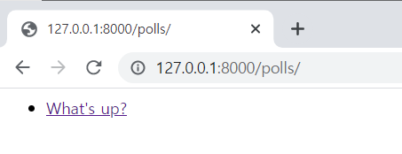

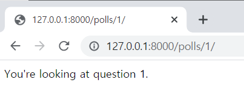

